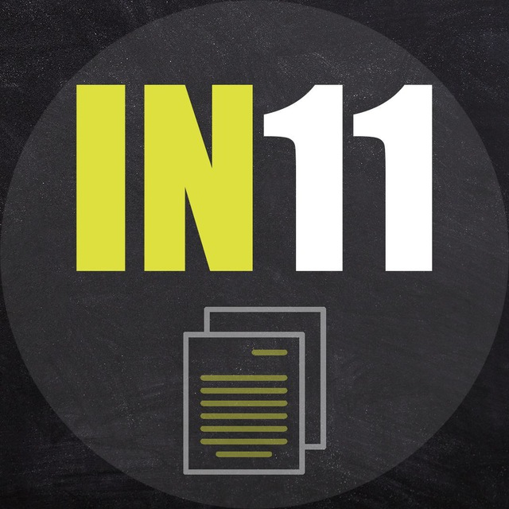

<!-- PROJECT LOGO -->
<br />
<div align="center">
  <a href="https://github.com/asv-dev/incourse11">
    
  </a>

<h3 align="center">Incourse#11 Monorepo</h3>

  <p align="center">
    Monorepo with the code from all lessons
    <br />
    <a href="https://asv-dev.github.io/incourse11/"><strong>View Live Result »</strong></a>
  </p>
</div>


<!-- ABOUT THE PROJECT -->
## About The Project

This is a monorepo which contains all code from all our lessons.
I've decided to store everything in 1 place in order to:

* You to have easy access to all historical data 
* There is a live version stored on github, so you can check the result from every lesson by the link above
* You will have experience on working with the repository which is constantly updating


<!-- GETTING STARTED -->
## Getting Started

Follow next steps to get started using the same builder in monorepo to launch code that we wrote on a lesson locally on your machine.

### Prerequisites

This project is running by NodeJs and I have some packages installed via yarn, so you need to install both
1. Install Node Js LTS version from the [Official Website](https://nodejs.org/en/)
2. Using NPM (node package manager) install yarn globally
  ```sh
  npm install -g yarn
  ```

### Installation

_Below you can find steps how to setup local dev environment for this project._

1. Clone the repo
   ```sh
   git clone git@github.com:asv-dev/incourse11.git
   ```
2. Install NPM packages via yarn
   ```sh
   yarn install
   ```
3. Launch the development mode of project
   ```sh
   yarn dev
   ```
4. Open the [http://localhost:3001](http://localhost:3001) link in browser to see the result
5. You can navigate by different urls by adding page name as a name of folder to url [http://localhost:3001/flexbox](http://localhost:3001/flexbox) will open flex lesson

<!-- CONTACT -->
## Contact

Anton Vitrenko - [@Anttonyy](https://t.me/Anttonyy)

Project Link: [https://github.com/asv-dev/incourse11](https://github.com/asv-dev/incourse11)
